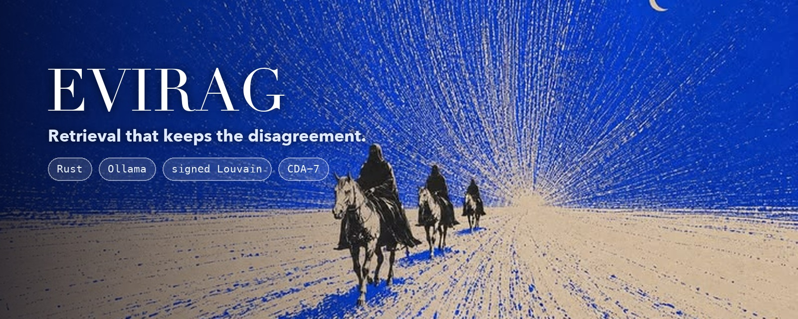

<p align="center"></p>

<p align="center">
  <a href="https://github.com/amethystani/evirag-bench/actions/workflows/rust.yml"></a>
  <a href="https://github.com/amethystani/evirag-bench/releases"></a>
  <a href="LICENSE"></a>
  
  
  
</p>

<p align="center">
  <a href="https://amethystani.github.io/evirag-bench/">Demo</a> ·
  <a href="paper/paper.pdf">Paper</a> ·
  <a href="CITATION.cff">Cite</a> ·
  <a href="CHANGELOG.md">Changelog</a> ·
  <a href="CONTRIBUTING.md">Contribute</a>
</p>

EVIRAG preserves disagreement across scientific retrieval and answer generation. The Rust executable provides the seven-stage pipeline, evaluation metrics, corpus tools, and baseline controls. The paper source and PDF are in `paper/`.

<p align="center">
  <a href="#i-pipeline">I. Pipeline</a> ·
  <a href="#ii-quickstart">II. Quickstart</a> ·
  <a href="#iii-corpus-and-benchmark">III. Corpus</a> ·
  <a href="#iv-run">IV. Run</a> ·
  <a href="#v-paper">V. Paper</a>
</p>

---

<a id="i-pipeline"></a>


```text
question ─► intent ─► role-based retrieval ─► atomic claims ─► pair labels + CDA-7 causes
                                                                        │
   source-linked views ◄─ temporal evidence ◄─ signed Louvain partition ◄┘
```

The full path first classifies the query as resolved or contested. Contested queries use four retrieval roles with budgets 3, 5, 4, and 3. The pipeline extracts atomic claims, labels claim pairs, assigns CDA-7 causes, partitions the signed graph with signed Louvain, tracks dated evidence, and synthesizes source-linked views. Resolved queries use a concise source-grounded answer. The JSONL output also includes a readable answer template. Use `--intent contested` to inspect all seven stages on a specific query.

Every view carries a **position**, an **evidence summary**, **weaknesses**, **disagreement causes**, **passage IDs**, and a **confidence tier**. The response layout is in [`docs/output.md`](docs/output.md).

<details>
<summary><b>CDA-7: why sources disagree</b></summary>

Every contradiction edge is labeled with one primary cause. The full guide is in [`docs/cda7.md`](docs/cda7.md).

| Cause | Meaning |
|---|---|
| Replication | A later attempt repeats the earlier design and fails to recover its finding. |
| Population | Samples, age groups, settings, or inclusion criteria differ. |
| Operational | Different definitions or outcome measures for the same named concept. |
| Methodological | Study design, intervention, protocol, or control strategy differs. |
| Statistical | Estimates or interpretations of uncertainty differ despite comparable designs. |
| Temporal | Evidence from a later period differs from evidence from an earlier period. |
| Theoretical | Competing explanatory frameworks account for the same observations. |

</details>

---

<a id="ii-quickstart"></a>


Install Rust and [Ollama](https://ollama.com/download). Start Ollama in one terminal:

```sh
ollama serve
```

In another terminal, run:

```sh
cargo build --release
./scripts/smoke.sh
```

The default run uses `qwen3.6:35b-a3b` and `all-minilm`. Use `scripts/fetch_models.sh` to pull both. `cargo test` checks corpus processing, signed Louvain, and scoring without downloading a model.

---

<a id="iii-corpus-and-benchmark"></a>


Documents are JSON Lines with `id`, `title`, `text`, optional `year`, `venue`, `domain`, `doi`, and `sections`. Each section has a `heading` and `text`. The chunker uses the pinned MiniLM tokenizer to make 256-token passages with overlap 32 within section boundaries. Document and chunk IDs keep claims linked to passages. The tokenizer is downloaded once into `data/tokenizer.json`.

To collect a new abstract corpus from OpenAlex:

```sh
target/release/evirag-bench fetch-openalex data/corpus/openalex_abstracts.jsonl --per-domain 200
```

The OpenAlex command collects abstracts and metadata. For full-paper experiments, provide full paper text in the same document format. If OpenAlex returns 429, set `OPENALEX_API_KEY` to an account key. See [OpenAlex authentication](https://help.openalex.org/api/authentication/).

Gold queries follow `data/schema.example.json`. The `sources` field identifies corpus passages. The annotation protocol is in `docs/annotation.md`. Validate a pilot with:

```sh
target/release/evirag-bench validate-gold data/gold/pilot.jsonl
```

Use `--full` for the 1,250-query, five-domain benchmark layout.

---

<a id="iv-run"></a>


```sh
target/release/evirag-bench chunk data/corpus/documents.jsonl data/corpus/chunks.jsonl
target/release/evirag-bench index data/corpus/chunks.jsonl data/index.json
target/release/evirag-bench run data/index.json data/gold/benchmark.jsonl runs/full.jsonl --system full
target/release/evirag-bench evaluate runs/full.jsonl data/gold/benchmark.jsonl runs/full.metrics.json
```

`scripts/run_all.sh` fetches the configured models and runs full EVIRAG, its two ablations, closed-book, vanilla at 10 and 15 passages, structured-prompt, single-agent, and MMR controls. Set `CORPUS`, `GOLD`, `MODEL`, `EMBED_MODEL`, or `EVI` to override defaults.

The full path first classifies the query as resolved or contested. Contested queries use four retrieval roles with budgets 3, 5, 4, and 3. The pipeline extracts atomic claims, labels claim pairs, assigns CDA-7 causes, partitions the signed graph with signed Louvain, tracks dated evidence, and synthesizes source-linked views. Resolved queries use a concise source-grounded answer. The JSONL output also includes a readable answer template. Use `--intent contested` to inspect all seven stages on a specific query.

The response layout is in `docs/output.md`; the disagreement labels are in `docs/cda7.md`.

Evaluation computes embedding viewpoint coverage at 0.65, single-view concentration, contradiction recall, confidence calibration error, retrieval coverage at K, faithfulness against cited passages, bootstrap intervals, and paired Wilcoxon tests with Bonferroni adjustment. See `docs/run-settings.md` for definitions and run settings.

For a quick sanity check of the core mechanism, `scripts/preliminary_check.sh` runs full EVIRAG, vanilla RAG, and the structured-prompt baseline on the homework fixture and reports views, contradiction links, and contradiction recall. It is a smoke-level check, not a substitute for the full benchmark.

---

<a id="v-paper"></a>


`paper/acl_latex.tex` is the camera-ready source, with its bibliography, figure, ACL style files, and PDF. Run `cd paper && ./build.sh` if `tectonic` is installed.

---

<sub>Banner artwork: Nicholas Roerich, Toshio Ebine and @khvostart, among others. All rights remain with their creators.</sub>

## Citation

```bibtex
@inproceedings{mishra2026evirag,
  title     = {Beyond Epistemic Collapse: Disagreement-Aware Scientific Retrieval-Augmented Generation},
  author    = {Mishra, Animesh and Sharma, Krishang and Khetarpaul, Sonia},
  booktitle = {Proceedings of EMNLP},
  year      = {2026}
}
```

Released under the [MIT License](LICENSE).
